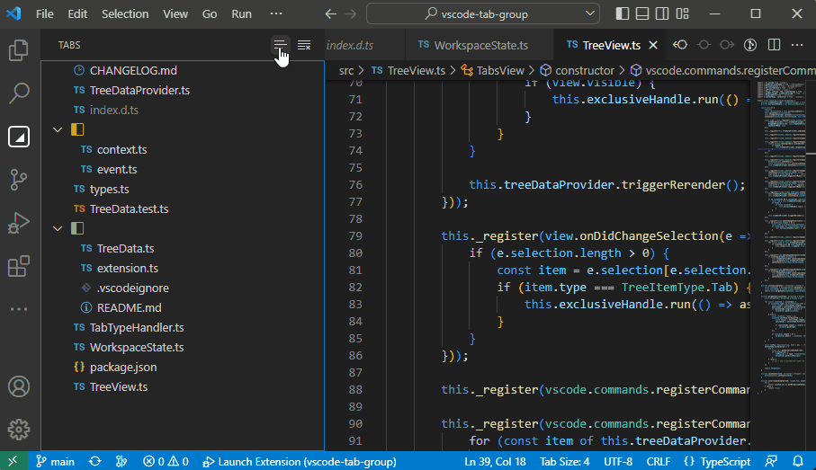

# vscode-tab-group
If you like vertical Tab Group feature in Edge, this extension is for you to use it in VSCode!

## Feature
- Drag and drop to group or ungroup tabs in the TABS view
- Use "Sort Mode" to reorder the tabs and groups
- Collapse/uncollapse all

## Usage
### Group and Ungroup

### Sort with "Sort Mode"

Notice: if item A is dragged onto item B, it will be inserted right before item B.

If you have a better idea on sorting the tree view nodes, please tell me. :)

**P.S. I am sorry that I may be late response because of some personal issues. Please just post issues or pull requests directly. Thank you!**
