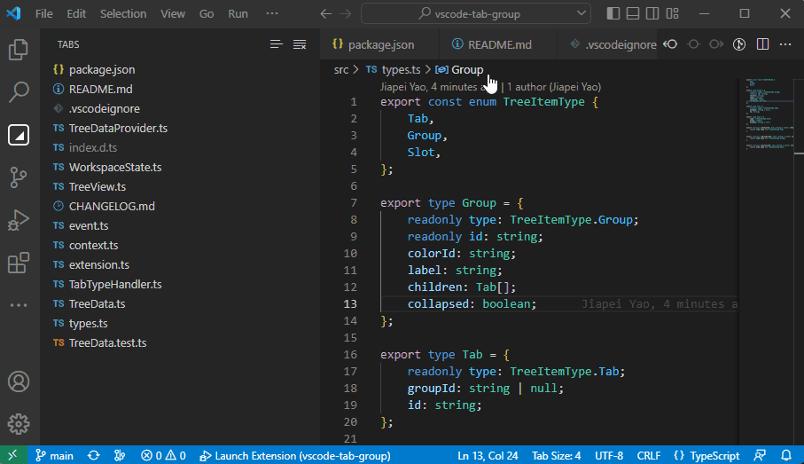
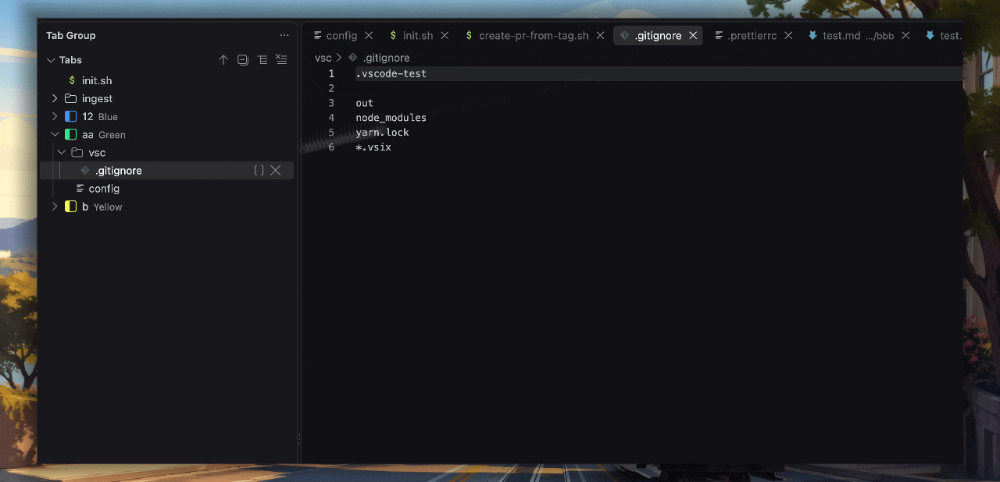
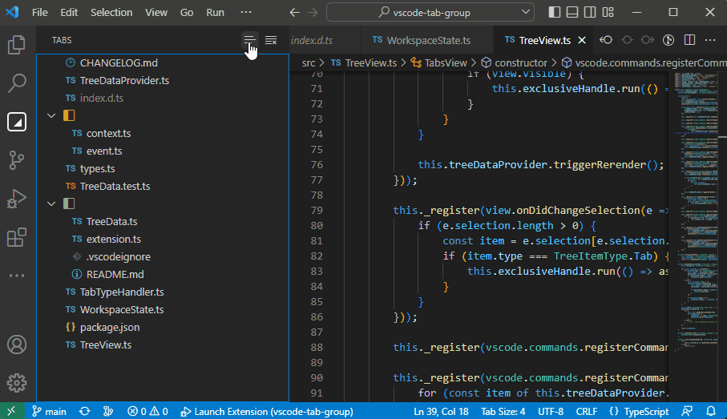
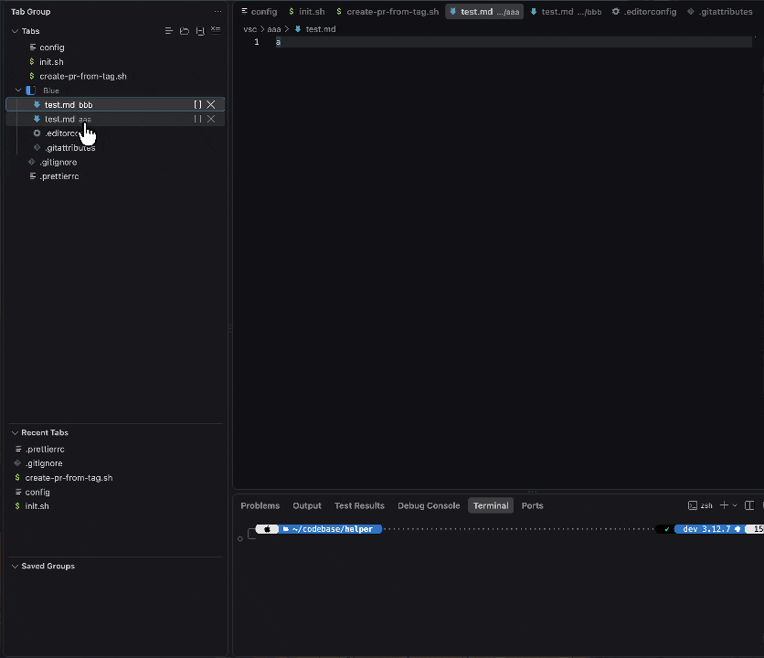

# Tab Group for VS Code

Organize editor tabs into persistent, named groups from the Tab Group activity-bar view. The extension is inspired by browser tab groups while respecting VS Code's native editor and tab behavior.



## Features

- Drag one or more tabs onto a tab or group to create and populate a named group.
- Choose a distinct color for each group.
- Drag tabs to the view background to ungroup them.
- Keep the visible Tabs view selection synchronized with the active supported editor tab, opening only its containing group and folder path.
- Switch the Tabs view between a GitLens-style file tree and a flat list from the view overflow menu.
- Use manual Sort Mode in List view to reorder tabs and groups without changing group membership.
- Sort root tabs by file URI, root groups by name, and each group's tabs by file URI.
- Sort saved groups by name from the Saved Groups panel.
- Rename, close, ungroup, or dissolve a group from its context menu.
- Collapse and expand all live groups, or toggle all saved snapshots in the Saved Groups panel.
- Preserve group membership, order, names, colors, and collapsed state in workspace state.
- Save named group snapshots, shown in a collapsed Saved Groups panel, and restore their supported tabs after they are closed.
- Show an unsaved-file decoration for text editors.
- Track text, text-diff, custom-editor, notebook, notebook-diff, and input-less system editor tabs.
- Show ungrouped tabs in a Recent Tabs view ordered by most recently viewed.

## Usage

Open the **Tab Group** activity-bar view. Drag tabs directly to group them. When a new group is created, enter an optional name. Use the view title actions to enter Sort Mode and to collapse, expand, or reset all groups.

Use the **...** menu in the Tabs view title to switch between **View as Tree** and **View as List**. Tree mode groups resource-backed tabs by workspace-relative directory inside the root and each named group. Resource-backed tabs outside the current workspace, and tabs without a usable resource path, remain direct leaves; external resource tabs show their full location in the tooltip. The selected view is persisted with the workspace. Manual **Sort Mode** is available only in List view, while the predefined URI sort actions remain available in both views.





Dropping an item onto another inserts it immediately before the target. In Sort Mode, tabs and groups can only be reordered within their current parent, so sorting never changes group membership. The view-title sort control orders root tabs by File URI, every group's tabs by File URI, and root groups by name. A group sort control orders only that group's tabs by File URI. Each control switches to the opposite direction after it is used. Group controls toggle independently, while a root sort resets every group control to its next direction. Root tabs and groups reorder only among their existing root positions. Sorting changes the Tabs tree only; it does not reorder VS Code's editor tabs. The **Recent Tabs** view lists ungrouped tabs by most recent activation; drag a tab from it onto a group in the **Tabs** view to organize it.



Use **Save Group...** from a group context menu to create or update a snapshot without entering a name. The snapshot uses the live group's ID as its stable identity and its group label as the display name, showing **untitled** when the group has no name. Renaming a live group automatically updates the title of its saved snapshot. Saving the same live group again updates its existing snapshot. Expand the **Saved Groups** panel to see snapshots and their tab counts, then expand a snapshot to inspect its saved files. Duplicate file names show the shortest distinguishing parent path. Use the panel toolbar to sort snapshots by name, expand or collapse all snapshots, restore all snapshots, or delete all snapshots. Saved snapshot order is persisted, and when snapshots share a tab, **Restore All Saved Groups** gives that tab to the first snapshot shown in the panel. Use a snapshot's folder action to restore it or its trash action to remove it from saved workspace storage. **Restore Saved Group...** is also available from the Command Palette.

## Tab support

Tab Group supports text editors, text diffs, custom editors, notebooks, and notebook diffs with stable IDs. Saved tab groups restore the same resource-backed input types.

System editor tabs that VS Code exposes without a public input, including Settings, Keyboard Shortcuts, and extension detail pages, appear in the Tabs tree. They can be grouped and closed while open. VS Code does not expose a public operation to activate or reopen an individual system-editor instance, so these tabs are not included in Saved Groups. When saving a mixed group, Tab Group saves its restorable tabs and reports any skipped live-only tabs; a group containing only live-only tabs cannot be saved. Restoring into the existing live group preserves any currently open live-only system tabs while replacing its saved-tab members.

Terminal and webview panel tabs remain omitted. `TabInputTerminal` has no public identity fields, while `TabInputWebview` exposes only a view type rather than an individual instance identity. Unknown and future tab inputs are also skipped when a stable current-session identity cannot be derived.

## Development

```bash
npm ci
npm run compile
npm run test:unit
npm run test:e2e
```

Use **Run Extension** in VS Code to launch an Extension Development Host. See [docs/testing.md](docs/testing.md) for automated and manual testing, and [docs/development.md](docs/development.md) for packaging, CI, and Marketplace releases.

## Contributing and Support

Please report defects and feature requests in the [issue tracker](https://github.com/billgoo/vscode-tab-group/issues). Read [SUPPORT.md](SUPPORT.md) for support expectations.
