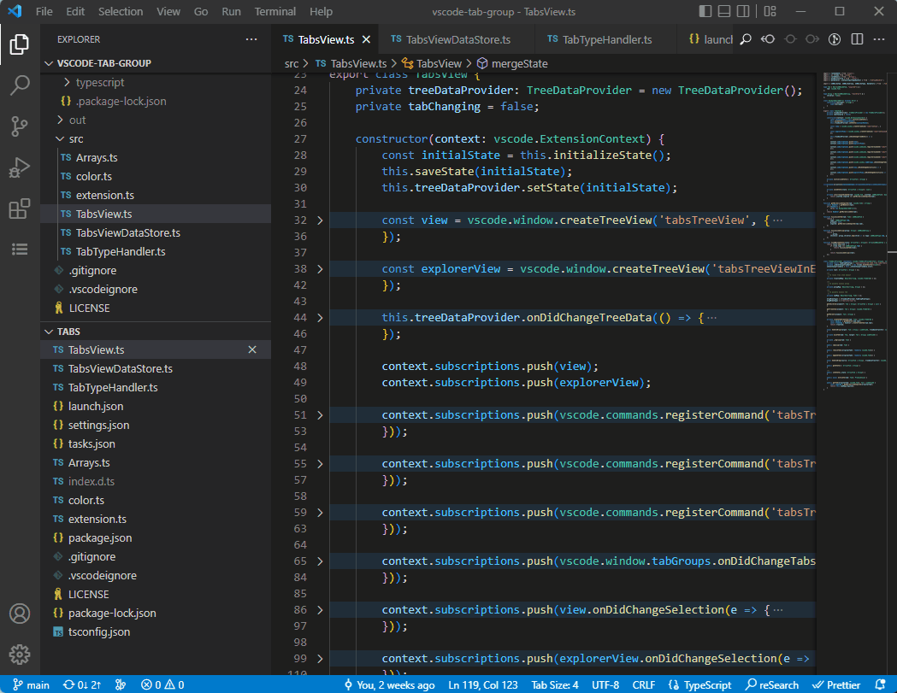

# Tab Group for VS Code

Organize editor tabs into persistent, named groups from the Tab Group activity-bar view. The extension is inspired by browser tab groups while respecting VS Code's native editor and tab behavior.



## Features

- Drag one or more tabs onto a tab or group to create and populate a named group.
- Choose a distinct color for each group.
- Drag tabs to the view background to ungroup them.
- Use Sort Mode to reorder tabs and groups without changing group membership.
- Rename, close, ungroup, or dissolve a group from its context menu.
- Collapse and expand all groups.
- Preserve group membership, order, names, colors, and collapsed state in workspace state.
- Show an unsaved-file decoration for text editors.

## Usage

Open the **Tab Group** activity-bar view. Drag tabs directly to group them. When a new group is created, enter an optional name. Use the view title actions to enter Sort Mode and to collapse, expand, or reset all groups.


Dropping an item onto another inserts it immediately before the target. In Sort Mode, dropping on the final slot appends it.

## Development

```bash
npm ci
npm run compile
npm run test:unit
npm run test:e2e
```

Use **Run Extension** in VS Code to launch an Extension Development Host. See [docs/testing.md](docs/testing.md) for automated and manual testing, and [docs/development.md](docs/development.md) for packaging, CI, and Marketplace releases.

## Contributing and Support

Please report defects and feature requests in the [issue tracker](https://github.com/billgoo/vscode-tab-group/issues). Read [SUPPORT.md](SUPPORT.md) for support expectations.
